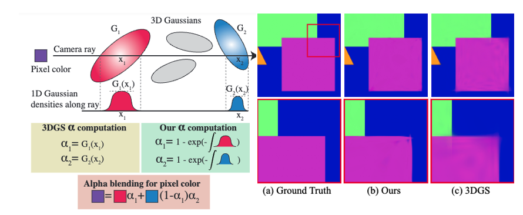

# Volumetrically Consistent 3D Gaussian Rasterization
 **<span style="color:red">CVPR 2025 Highlight</span>**

[](https://arxiv.org/pdf/2412.03378) [](https://chinmay0301.github.io/vol3dgs/)

This is the official implementation of the paper "Volumetrically Consistent 3D Gaussian Rasterization" 

>Abstract:
Recently, 3D Gaussian Splatting (3DGS) has enabled photorealistic view synthesis at high inference speeds. However, its splatting-based rendering model makes several approximations to the rendering equation, reducing physical accuracy. We show that the core approximations in splatting are unnecessary, even within a rasterizer; we instead volumetrically integrate 3D Gaussians directly to compute the transmittance across them analytically. We use this analytic transmittance to derive more physically-accurate alpha values than 3DGS, which can directly be used within their framework. The result is a method that more closely follows the volume rendering equation (similar to ray-tracing) while enjoying the speed benefits of rasterization. Our method represents opaque surfaces with higher accuracy and fewer points than 3DGS. This enables it to outperform 3DGS for view synthesis (measured in SSIM and LPIPS). Being volumetrically consistent also enables our method to work out of the box for tomography. We match the state-of-the-art 3DGS-based tomography method with fewer points.



- [X] Code for View Synthesis Rasterizer
- [X] Code for Tomography Rasterizer

## Installation 
Our rasterizer is implemented in [slangtorch](https://github.com/shader-slang/slang-torch), based on the [slang implementation](https://github.com/google/slang-gaussian-rasterization) of 3DGS. We then integrated this rasterizer in the [official 3DGS codebase](https://github.com/graphdeco-inria/gaussian-splatting) for view synthesis experiments. In case of installation issues, please refer to the [Gaussian Splatting codebase](https://github.com/graphdeco-inria/gaussian-splatting), and the issues/solutions referenced there. 

1. Clone the repository recursively, along with the submodules.
```
git clone --recursive https://github.com/chinmay0301ucsd/Vol3DGS
cd Vol3DGS
git submodule update --init --recursive
```
2. Create and activate [Anaconda](https://www.anaconda.com/docs/tools/working-with-conda/environments) environment using the provided `environment.yml` file, and then pip install the other requirements. We tested our code with Python3.9.20 on a 3090 Ti, with Driver Version: 525.147.05, Ubuntu 22.04. Update the environment.yml file, if you are using a different version of cuda toolkit / pytorch. It should work with higher versions as well, but make sure to adjust the torch versions in `install.sh` accordingly. Note that slangtorch requires a system-wide nvcc/cuda-toolkit installation as well, to use the linker for compiling cuda kernels. The version of the system-wide toolkit can be different from the one in the environment.yml file.
```
conda env create -f environment.yml
conda activate vol3dgs
conda install -c nvidia cudatoolkit=11.7 cuda-cudart-dev=11.7 cuda-nvcc=11.7
bash install.sh
```
<!-- 3. Alternatively, if you already have a working 3DGS conda environment, install the following in that environment:
```
pip install slangtorch==1.3.7 wandb matplotlib tqdm
pip install -e submodules/slang-gaussian-rasterization
``` -->

## Training
We use the same dataset format as 3DGS. 
* Download nerfsynthetic from [this](https://www.kaggle.com/datasets/nguyenhung1903/nerf-synthetic-dataset) link. 
* MipNeRF360 dataset can be downloaded from [here](https://jonbarron.info/mipnerf360/). 
* Tanks and temples, and deepblending datasets from the [3DGS project page](https://repo-sam.inria.fr/fungraph/3d-gaussian-splatting/).
To process a custom dataset, follow the instructions [here](https://github.com/graphdeco-inria/gaussian-splatting?tab=readme-ov-file#processing-your-own-scenes).  

Example training command for lego dataset - 

```
python3 train_volr.py -s <lego_datapath> -m output/vol3dgs_lego --render_backend slang_volr --eval --densify_from_iter 50000 --disable_opacity_reset
```
Set `--render_backend` to `slang` for 3DGS slang rasterizer, `slang_volr` uses our rasterizer.

See `scripts/all_datasets.sh` for example commands (with hyperparameters and flags) to reproduce results on other datasets. 

## Rendering and Evaluation
For rendering, and evaluating metrics, use `render.py` and `metrics.py`, which are adopted as is from the 3DGS codebase with minor modifications. 

```
python3 render.py -m <output_model_path> --render_backend slang_volr --skip_train
python3 metrics.py -m <output_model_paths> 
```

## Implementation Notes
* To avoid numerical instability, we have re-worked handling Gaussians with NaN scales (happens for Gaussians with very small scales due to numerical errors in the backprop for the scale parameter) in the rasterizer itself, to avoid NaNs in the gradients. We have also upgraded to the lastest slangtorch version for the code release.

* We have also added support for [AbsGS](https://ty424.github.io/AbsGS.github.io/) in our slang rasterizer, a better densification method (which we DO NOT use for this paper). To use that, add `--abs_gs` to the training command.

* Incase there's issues in compiling slangtorch kernels while running the code, ensure that the paths are correctly set. Contact [slang discord](https://discord.gg/HaW3huae) for help, or raise an issue here. 

## Tomography
Please follow the instructions at [https://github.com/chinmay0301ucsd/r2_gaussian](https://github.com/chinmay0301ucsd/r2_gaussian) for setting up the tomography codebase, rasterizer and datasets.

## Citation
If you find our work and code useful, please cite this work and ⭐ the repo:

```@misc{talegaonkar2025vol3dgs,
      title={Volumetrically Consistent 3D Gaussian Rasterization},
      author={Chinmay Talegaonkar and Yash Belhe and Ravi Ramamoorthi and Nicholas Antipa},
      year={2025},
      eprint={2412.03378},
      archivePrefix={arXiv},
      primaryClass={cs.CV}
}
```
## Acknowledgements
We thank [George Kopanas](https://grgkopanas.github.io/) for releasing the 3DGS slang implementation, and [Sai Praveen Bangaru](https://people.csail.mit.edu/sbangaru/) for helping with questions regarding slangtorch. Also thanks to [Alex Mai](https://half-potato.gitlab.io/) for helpful insights and providing metrics for the EVER paper on Tanks and Temples, and DeepBlending datasets. We also thank the [R2-Gaussian](https://github.com/chinmay0301ucsd/r2_gaussian) authors for providing an excellent codebase, making it easy to integrate our rasterizer into theirs.